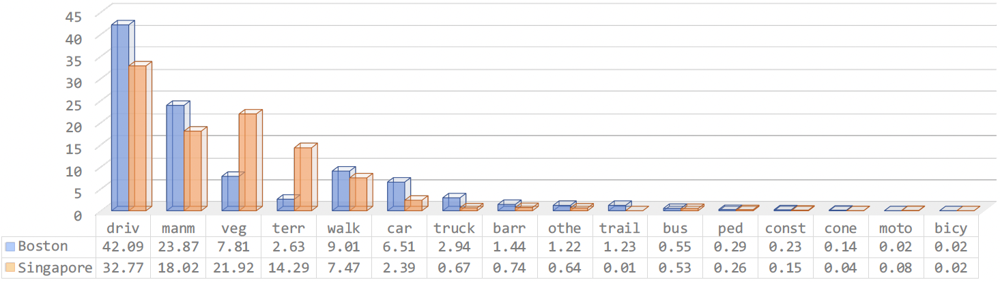

# ConDA

### [Project](https://ldkong.com/ConDA) | [Paper](https://arxiv.org/abs/2111.15242) | [Benchmark](https://paperswithcode.com/dataset/nuscenes-cross-city-uda)

**[ConDA: Unsupervised Domain Adaptation for LiDAR Segmentation via Regularized Domain Concatenation](https://arxiv.org/abs/2111.15242)**
<br>
[Lingdong Kong](https://scholar.google.com/citations?user=-j1j7TkAAAAJ) <sup>1,\*</sup>,
[Niamul Quader](https://scholar.google.com/citations?user=x-HGzWwAAAAJ) <sup>2</sup>,
[Venice Erin Liong](https://scholar.google.com/citations?user=q3AmlWMAAAAJ) <sup>2</sup>
<br>
<sup>1</sup>National University of Singapore, <sup>2</sup>Motional
<br>
<sup>\*</sup>Work done as an autonomous vehicle intern at Motional

:oncoming_automobile: **This is not an official Motional product**

## About

ConDA aims at processing raw point clouds for unsupervised domain adaptation (UDA) in **LiDAR semantic segmentation**. It also supports other domain adaptation settings under annotation scarcity, such as semi-supervised domain adaptation (SSDA) and weakly-supervised domain adaptation (WSDA). The main idea of ConDA is to (1) construct an **intermediate domain** consisting of fine-grained interchange signals from both source and target domains without destabilizing the semantic coherency of objects and background around the ego-vehicle; (2) utilizes the intermediate domain for self-training. Visit our [project page](https://ldkong.com/ConDA) to explore more details!

<p align="middle">
  
</p>


## Cross-City UDA Benchmark
<p align="middle">
  
</p>

## Updates
- [2022.09] - Our paper is available on arXiv, click [here](https://arxiv.org/abs/2111.15242) to check it out. Code will be available soon!

## Outline

- [Installation](#installation)
- [Data Preparation](#data-preparation)
- [Getting Started](#getting-started)
- [Main Results](#main-results)
- [TODO List](#todo-list)
- [License](#license)
- [Acknowledgement](#acknowledgement)
- [Citation](#citation)


## Installation
Please refer to [INSTALL.md](docs/INSTALL.md) for the installation details.


## Data Preparation
Please refer to [DATA_PREPARE.md](docs/DATA_PREPARE.md) for the details to prepare the **cross-city UDA benchmark** with [nuScenes](https://www.nuscenes.org), 


## Getting Started
Please refer to [GET_STARTED.md](docs/GET_STARTED.md) to learn more usage about this codebase.


## Main Results

### Framework Overview
<p align="center">
  
</p>

### Domain Discrepancy
<p align="center">
  
</p>

## TODO List

- [x] Initial release. :rocket:
- [x] Add license. See [here](#license) for more details.
- [ ] Add installation details.
- [ ] Add data preparation details.
- [ ] Add evaluation details.
- [ ] Add training details.


## License
<a rel="license" href="http://creativecommons.org/licenses/by-nc-sa/4.0/"></a>
<br />
This work is under the <a rel="license" href="http://creativecommons.org/licenses/by-nc-sa/4.0/">Creative Commons Attribution-NonCommercial-ShareAlike 4.0 International License</a>.


## Acknowledgement
We thank Sergi Widjaja, Xiaogang Wang, Dhananjai Sharma, and Edouard Francois Marc Capellier for their insightful reviews and discussions.

## Citation
```
@article{kong2021conda,
  title = {ConDA: Unsupervised domain adaptation for LiDAR segmentation via regularized domain concatenation},
  author = {Lingdong Kong and Niamul Quader and Venice Erin Liong},
  journal = {arXiv preprint arXiv:2111.15242},
  year = {2021}
}
```

